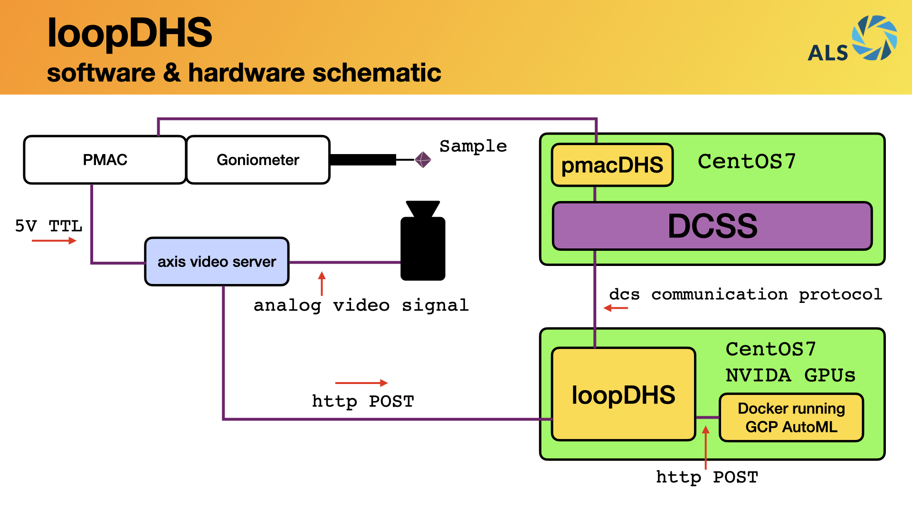

============
Installation
============

loop-dhs is not a standalone software project. It is designed to work in conjunction with `DCSS`_ Control system, a properly configured `AXIS Video`_ server, and an edge-deployed Google `AutoML`_ inference model running on a local docker instance.

This shows a conceptual schematic of how the various pieces of hardware and software are configured at beamline 8.3.1 to support loopDHS.

Dependencies
------------

* virtualenv
* python 3.8 (might work on 3-6-3.7, I haven't tested)
* `pydhsfw`_

Install
-------

Checkout the code from `GitHub <https://github.com/dsclassen/loop-dhs>`_::

   $ git clone git@github.com:dsclassen/loop-dhs.git
   $ cd loop-dhs

Setup and source a python virtualenv::

   $ virtualenv -p python3.8 .env
   $ source .env/bin/activate
   $ pip install --upgrade pip

Install into local python environment::

   $ pip install -e .

.. note::
   I have not yet figured out how to add ``pydhsfw`` to the install dependencies in setup.cfg. You need to install pydhsfw dependency manually for now.

Install `pydhsfw`_ manually for now::

   $ cd some_working_dir
   $ git clone git@github.com:tetrahedron-technologies/pydhsfw.git
   $ cd pydhsfw
   $ pip install -e .

.. _AXIS Video: https://www.axis.com/en-us/products/video-encoders
.. _pydhsfw: https://github.com/tetrahedron-technologies/pydhsfw
.. _Macromolecular Crystallography Group: https://www-ssrl.slac.stanford.edu/smb-mc/
.. _SLAC: https://www-ssrl.slac.stanford.edu
.. _DCSS: https://www-ssrl.slac.stanford.edu/smb-mc/node/1641
.. _AutoML: https://cloud.google.com/vision/automl/docs